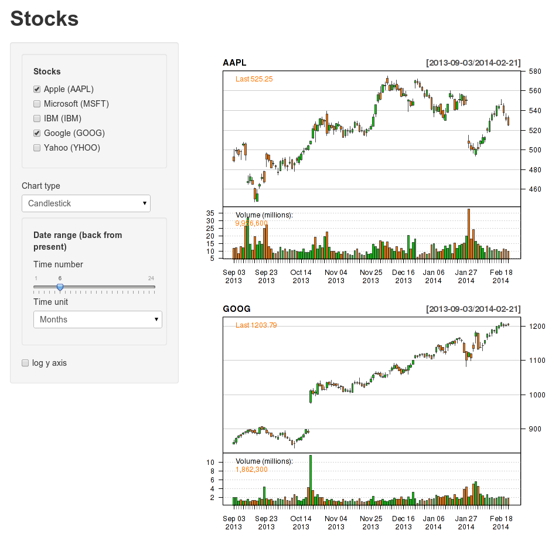

01 - Setup and Introduction to Shiny
========================================================
author: R Workshops
date: Spring 2014

It's So Shiny!
========================================================


***
**Shiny** is an R package that allows you to easily create interactive web applets using R. 

- Produced by [RStudio](http://www.rstudio.com/shiny/)
- Code can be entirely within R (or customize with HTML/JavaScript)
- Take a look at RStudio's [showcase](http://www.rstudio.com/shiny/showcase/) of Shiny applets

Shiny Documentation and Help
========================================================
- [RStudio Tutorial](http://rstudio.github.io/shiny/tutorial/#welcome)  
Much of tonight's material is borrowed from this tutorial
- [Shiny Setup, Showcase, and Server setup](http://www.rstudio.com/shiny/)  
Useful if you want to use shiny on your own webserver
- [Shiny Github Page](https://github.com/rstudio/shiny)  
See the latest updates
- [Shiny Mailing List](https://groups.google.com/forum/#!forum/shiny-discuss)  
Check the tutorial first, then search the mailing list.

Installing Shiny
========================================================


```r
install.packages("shiny")
```

Open up the file 01-Setup.R on the website and run the first code chunk to get setup for this workshop. You should have the packages `shiny`, `ggplot2`, `lubridate`, and `plyr` loaded. 

A Simple Example
========================================================

```r
library(shiny)
runExample("01_hello")
```

<center>

</center>


A Simple Example
========================================================

```r
library(shiny)
runExample("01_hello")
```


The code for this applet is here:
- [ui.R](../Code/Applet1/ui.R)
- [server.R](../Code/Applet1/server.R)
